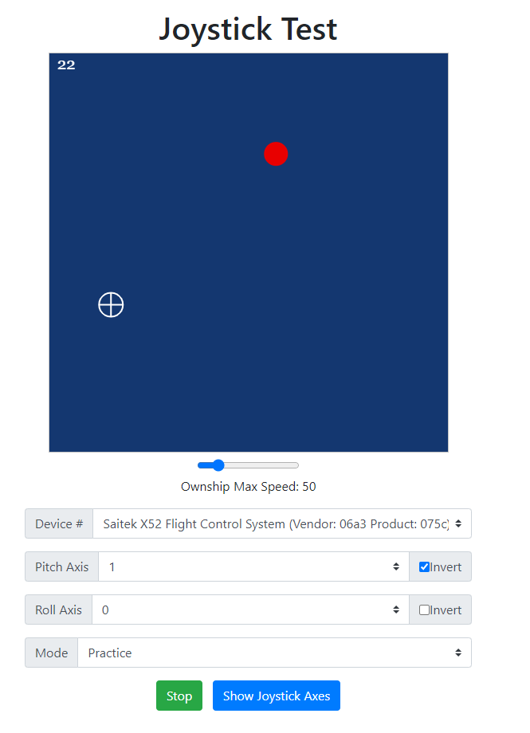

Joystick Test is a webpage that allows users to practice using a joystick or gamepad.

## Features
* Use any joystick or controller with an axis
* View current axis status using the "View Joystick Data" button
* Assign pitch and roll to desired axis
* Invert pitch or roll.
* Change speed of joystick movement
* Chase and Practice mode.
* Chase mode: Follow red target. View seconds successfully on target in top left.
* Practice mode: Get used to the feel of the movement. View number of targets hit in top left.

## Installation
* Visit http://13.58.66.17/joystick/ for hosted version.
* Download the 'page_src' directory. Then open Google Chrome and press Ctrl+O to open a file. Navigate to the page_src directory and open 'page_src/index.html'

## Usage
1. Open the webpage via hosted version or download.
2. Plug in a USB joystick or controller.
3. Detect controller by pressing button or moving joystick.
4. Select the joystick from the 'Device #' drop down.
5. Click the 'Show Joystick Axes' button at the bottom to open the axis info.
6. Move the desired pitch axis (up and down on the joystick). Take note of which axis moves.
7. Move the desired roll axis (left and right on the joystick). Take note of which axis moves.
8. Use the 'Pitch Axis' dropdown to enter the pitch axis number.
9. Use the 'Roll Axis' dropdown to enter the roll axis number.
10. Use the 'Mode' dropdown to select a game mode.
  * Practice: A single non-moving target appears. Move your joystick to the target as fast as possible.
  * Chase: Track a moving target that changes direction the more your successfully track the target.
11. Tune the joystick speed using the 'Ownship Max Speed' slider
12. Invert desired axis using the 'Invert' checkbox's.

## Photos

## License
[MIT](https://choosealicense.com/licenses/mit/)
